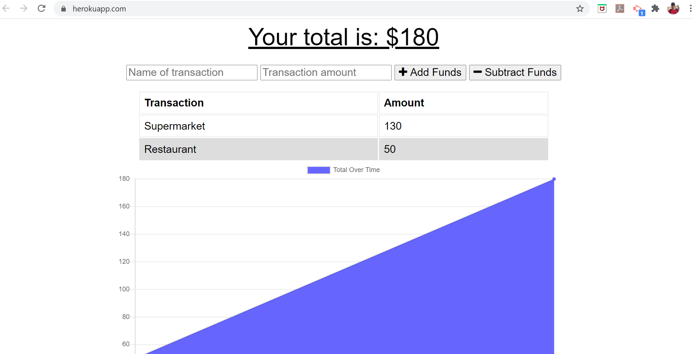

# fitness-tracker

## Description :octocat:

Use this app to track your budget. It was built to be used online (mongodb) and offline (indexeddb). When there is no connection, data
will be saved locally. When network back online, data is synchronized with network database.

## Table of Contents

* [Installation](#installation)

* [License](#license)

* [Contributing](#contributing)

* [Test](#test)

* [Questions](#questions)

## Installation

Open git bash, or terminal, and clone the git repo in a new local folder. 
Create a database called 'budget' in mongodb.

## Usage

Open terminal, and type 'node server', then point it to "localhost:3000" to open the main page.

## License

Free

## Contributing

Send me an email if you have ideas on how to make this app better.

[My GitHub Profile](https://github.com/correaph)

## Test

No test cases were created, but you can simply manipulate some data via app, and check directly on the database.

## Questions

Is it easy to make changes, like adding additional info to the budget ? Yes, the project is well documented.

Send me an e-mail <henriqueph@hotmail.com>